### 题目描述:

- 首先搭建一个基于 json-server 的、用于提供后端数据访问接口的Restful API服务器;
- 然后构建一个前端应用程序,调用上述Restful接口,实现对后端数据的增删改查功能。

### 要求:
- 前端应用需构建构建五个文件 index.html 、 add.html 、 delete.html 、 update.html 、 query.html ,分别完成主⻚导航、数据增加、数据删除、数据修改、和数据查询的功能;主⻚文件为 index.html ,其中包含上述另外四个文件的导航链接。
- 前端所使用的Ajax调用技术至少包括 fetch() 、 jquery.ajax() 和 Axios 这3种技术中的2种()。(本次add,delete使用 jquery.ajax()实现 , 而query,update使用Axios实现)
- 除了提交前端应用代码之外,还需一并提交关于如何搭建和启动 json-server ,和所开发的数据访问接口的说明文档。

### 搭建 json-server

进入指定文件夹后，终端输入npm init，根据提示输入包名，描述信息，版本号等等，参考如下：

```bash
npm init                         ±[main]
This utility will walk you through creating a package.json file.
It only covers the most common items, and tries to guess sensible defaults.

See `npm help init` for definitive documentation on these fields
and exactly what they do.

Use `npm install <pkg>` afterwards to install a package and
save it as a dependency in the package.json file.

Press ^C at any time to quit.
package name: (final-assignment(json-server)) jsonserver
version: (1.0.0) 
description: REST API
entry point: (index.js) 
test command: 
git repository: 
keywords: 
author: rewine
license: (ISC) 
About to write to /home/rewine/src/web/Final assignment(json-server)/package.json:

{
  "name": "jsonserver",
  "version": "1.0.0",
  "description": "REST API",
  "main": "index.js",
  "scripts": {
    "test": "echo \"Error: no test specified\" && exit 1"
  },
  "author": "rewine",
  "license": "ISC"
}


Is this OK? (yes) yes
```

成功后会出现一名为package.json的文件，修改其中的scripts，如下

```javascript
"scripts": {
    "json:server": "json-server --watch db.json"
 }
```

使用npm安装json-server

```bash
npm install --save json-server
```

新建文件db.json，用来保存数据，建立学生表，包含：学号，姓名，性别，年龄 ，手机号属性。

可以先添加一个实例。

```json
{
  "student": [
    {
      "id": "1",
      "name": "Li Hua",
      "gender": "male",
      "age": "25",
      "TelNum": "17734343268"
    }
  ]
}
```

### 启动 json-server

```bash
cd json-server # 进入指定目录
npm run json:server
```

### 数据访问接口

浏览器打开  http://localhost:3000 显示home页

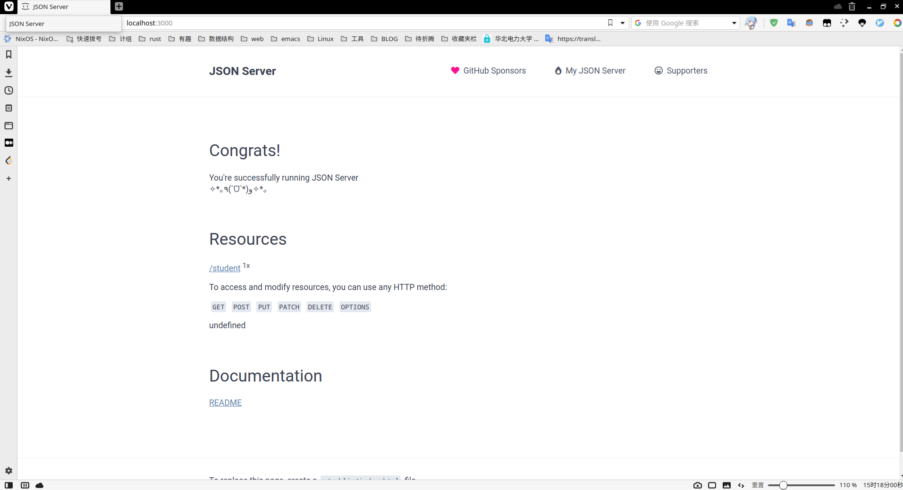


浏览器打开  http://localhost:3000/student 显示所有学生数据

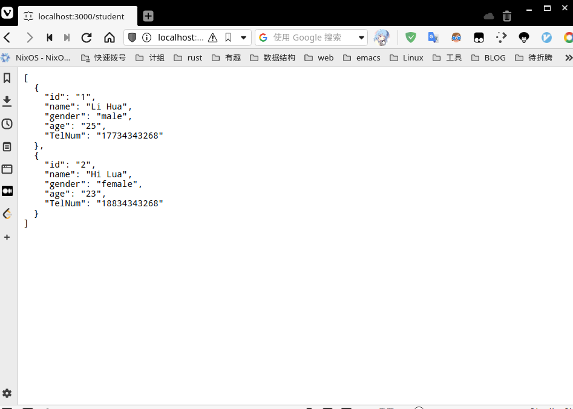

浏览器打开  http://localhost:3000/id 显示单个学生数据，如id=1时

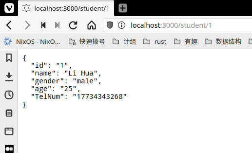

浏览器打开  http://localhost:3000/?age=25  显示年龄为25的学生的数据

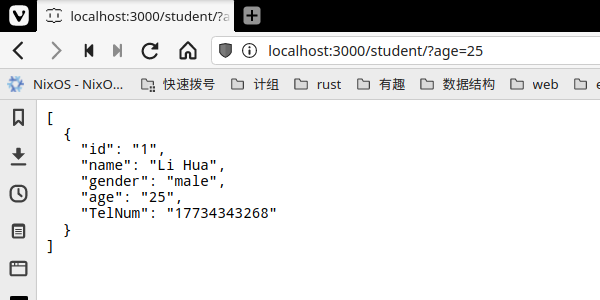

浏览器打开 http://localhost:3000/student/?age_gte=23&age_lte=25， age_gte,age_lte分别限制年龄最小最大值，进行范围查询

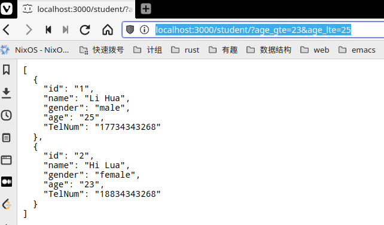

浏览器打开 http://localhost:3000/student?q=Li，q后跟的字符串"Li"，可以查询包含"Li"的学生信息

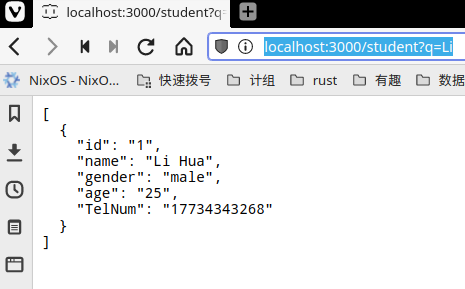

### 前端界面展示

#### 导航页

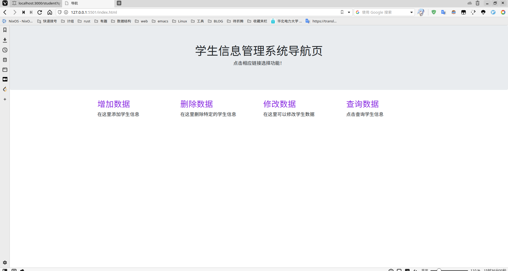

#### 增加数据

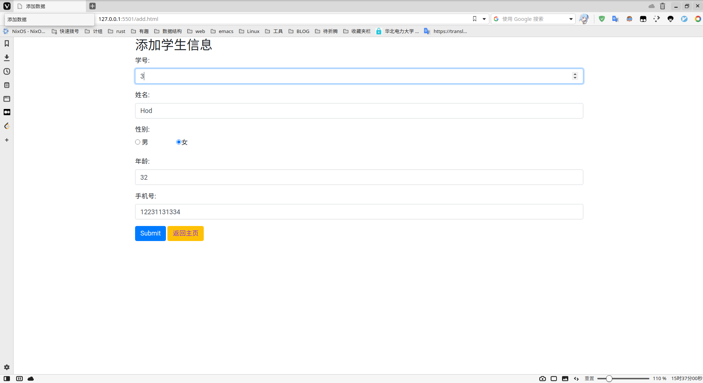

#### 删除数据

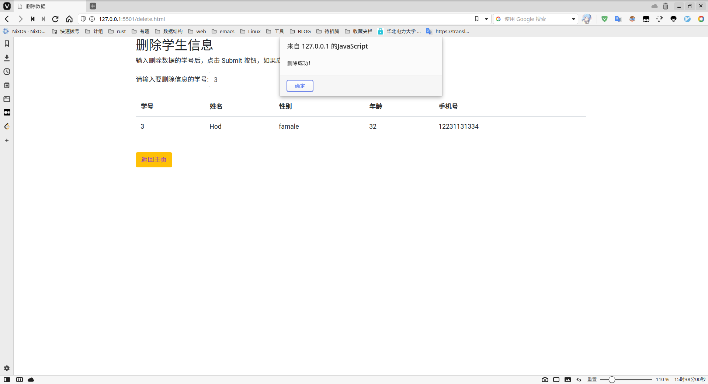

#### 修改数据

输入学号后，先点击获取按钮

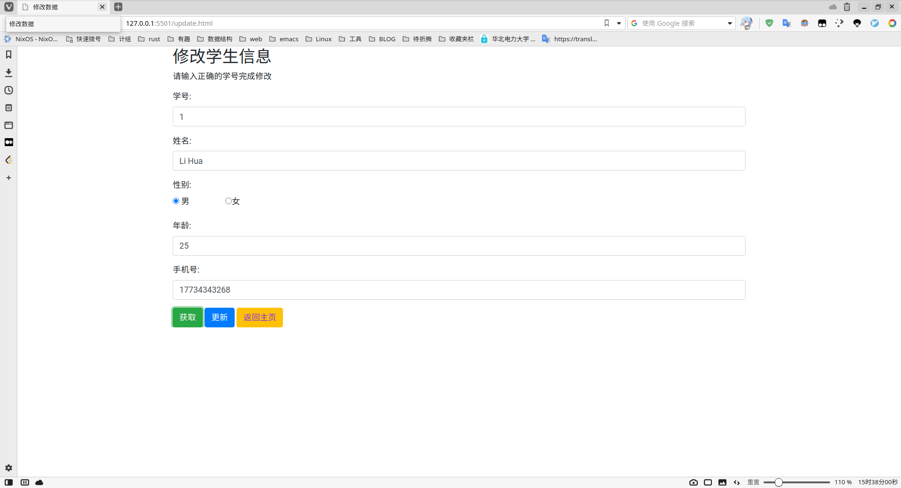

修改数据后，再点击更新按钮提交


#### 查询数据

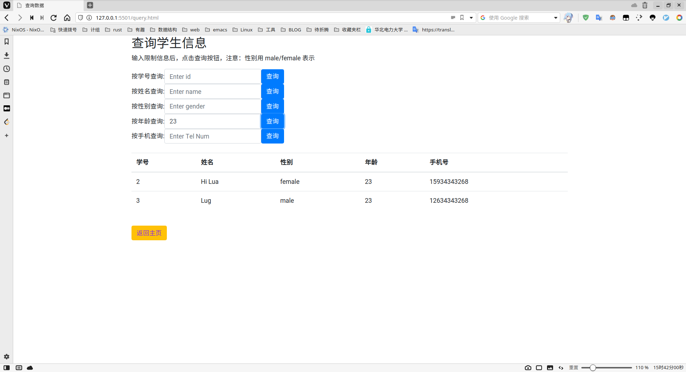

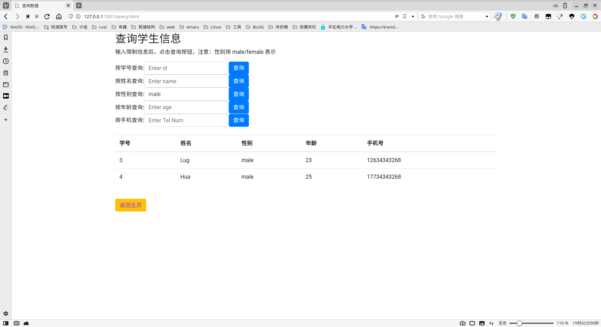