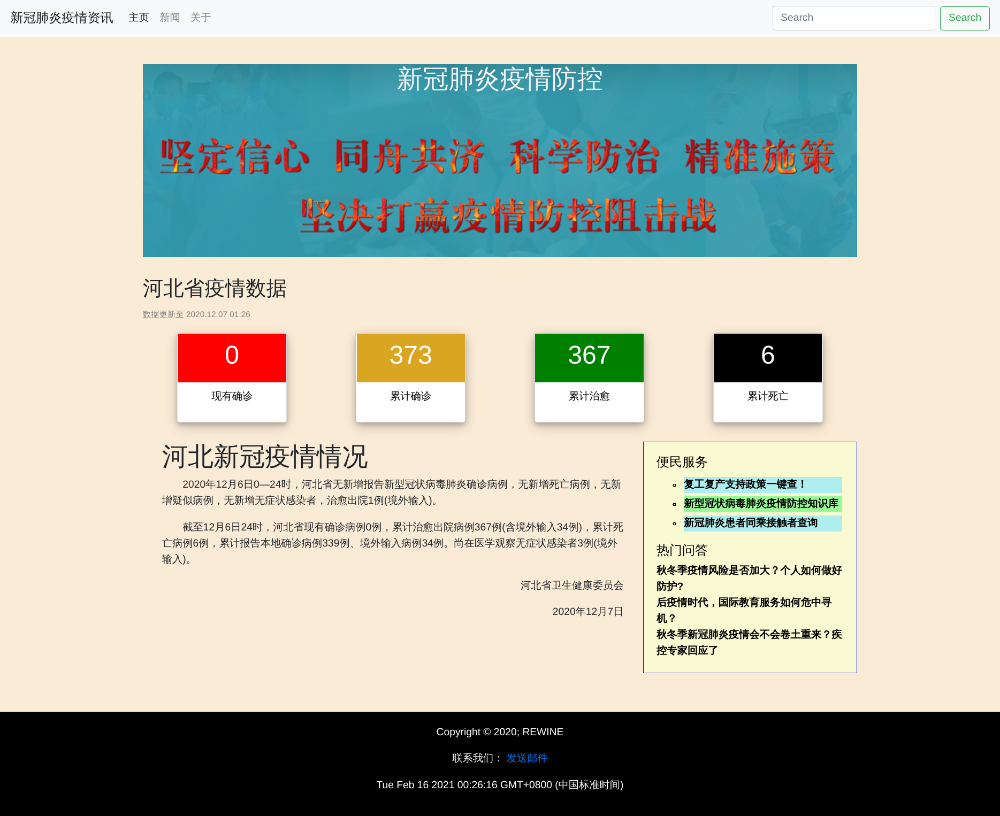
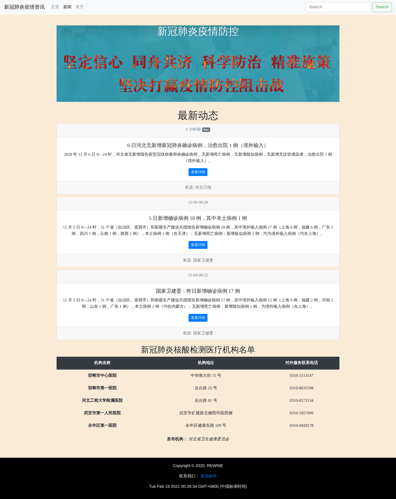
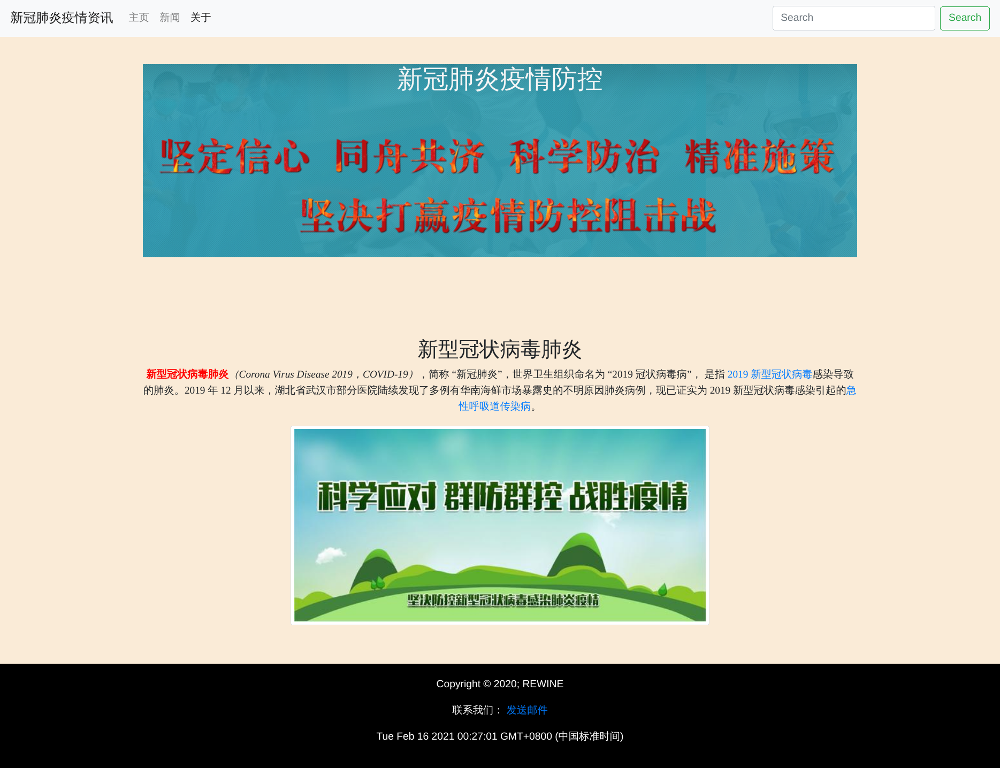

# Learn-Web

> 这是一个记录Web学习的仓库

### 准备

1、本课程的教学内容将采用慕课平台上北京林业大学孙俏老师主讲的《Web前端开发》课程的内容，该课程的教学视频已经公布在哔哩哔哩网站上，该课程PPT已经公布在github上，方便大家回看和复习。
https://github.com/los23kgs/Web-ppt
https://www.bilibili.com/video/av80610946

2、学习网站：
https://www.runoob.com/
https://www.w3cschool.cn/

3、VS Code插件安装：

- Auto Tag Name
- Bracket Pair Colorizer 2
- Chinese Language Pack for Visual Studio Code
- HTML CSS Support
- ESLint
- IntelliSence for CSS class name in HTML
- JavaScript(ES6) code Snippets
- Live Server
- npm
- npm IntelliSence
- Path Intellisence
- Rest Client
- vscode-icons
- YAML

补充Bootstrap可视化布局工具的官方网址：https://www.bootcss.com/p/layoutit/

### 期中作业

1、题目：设计一个小型主页网站
2、内容包括：
  - 网站的主题为同学们所在省份的疫情防控情况介绍。
  - 网站包含3个网页，包含1个一级主页和2个二级主页。
  - 网站采用原生HTML+CSS或者Bootstrap进行布局。利用盒子模型将主页粗略地分为：标题栏、导航栏、内容区、页脚区。
  - 网页元素包括：文字、列表、表格、图片、超链接、邮件链接、背景音乐、表单等。
  - 利用CSS、Bootstrap样式文件对以上网页元素进行美化。
  - 利用Javascript代码文件，在网页中增加适当的动态交互内容，要求使用DOM和BOM模型。
3、内容要求：
  - 网站的所有内容放在一个文件夹里面，下面放：一级主页名为index.html，二级主页topic1.html、topic2.html，网站样式文件site.css，网站javascript文件site.js，和用于放图片和音乐的figures文件夹，压缩后大小不超过1M。
  - 链接或者图片的定位使用相对定位，确保整体拷贝其他计算机也依然能够正常打开。
  - 网页HTML代码要保持干净整洁，不允许存在无功能的冗余代码。
  - 网页内容要真实、网站风格简洁朴素、协调。
  - 所有代码，必须自己完成，可以借鉴网上的例子，但是禁止抄袭。一经发现，期中成绩计零分。

** 代码见Mid-term assignment目录，界面展示如下: **

### 期末作业

要求：

首先搭建一个基于 json-server 的、用于提供后端数据访问接口的Restful API服务器;然后构建一个前端应用程序,调用上述Restful接口,实现对后端数据的增删改查功能。

- 前端应用需构建构建五个文件 index.html 、 add.html 、 delete.html 、 update.html 、 query.html ,分别完成主⻚导航、数据增加、数据删除、数据修改、和数据查询的功能;主⻚文件为 index.html ,其中包含上述另外四个文件的导航链接。
- 前端所使用的Ajax调用技术至少包括 fetch() 、 jquery.ajax() 和 Axios 这3种技术中的2种()。(本次add,delete使用 jquery.ajax()实现 , 而query,update使用Axios实现)
- 除了提交前端应用代码之外,还需一并提交关于如何搭建和启动 json-server ,和所开发的数据访问接口的说明文档。

基于  Flask + Marshmellow +  Sqlalchemy构建一个后端服务程序,提供对数据库访问的Restful API服务接口,该接口需要提供针对后端数据库的增删改查功能。

- 程序所提供的后端服务Restful API可以无需进行用户验证;
- 程序需包含至少一个自定义数据表(此处实现了学生表，包含编号，姓名，性别，年龄，手机号的属性)。
- 服务接口必须包含对于自定义表的增、删、改、查四个功能。
- 除了提交后端服务程序代码之外,还需提供数据服务接口的测试方法(比如:
  Postman)以及测试结果的说明文档;如果采用基于Python的后端和方案,则需同时提交用于pip重构程序运行环境的 ~~requirements~~ (使用pipfile)文件。

