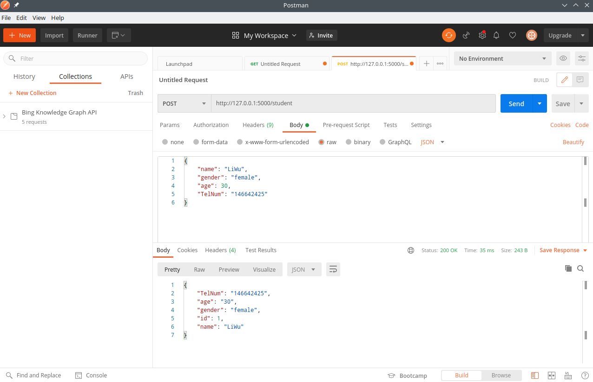
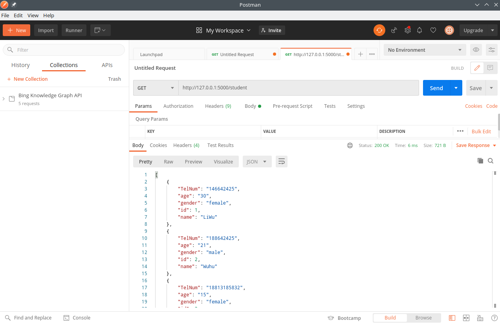
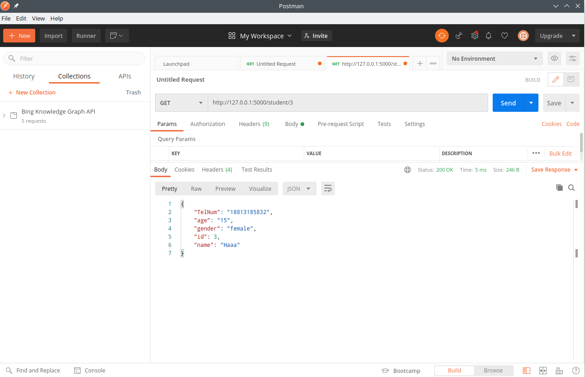
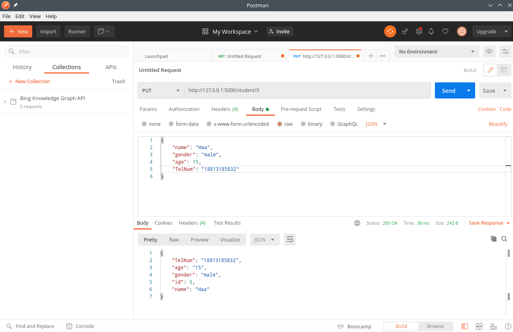
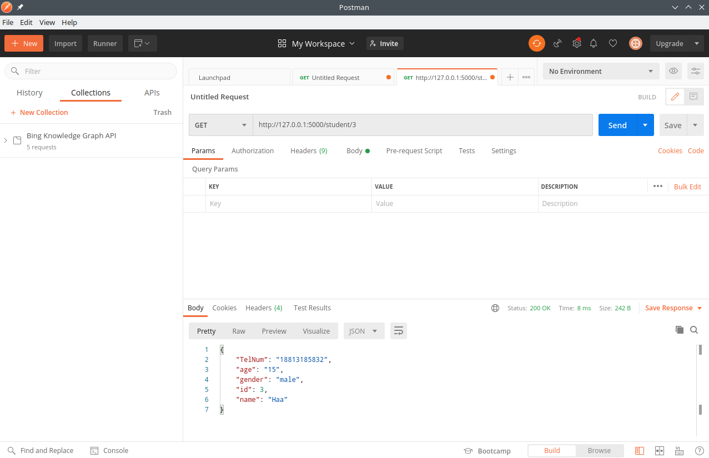

## 题目描述

基于  Flask + Marshmellow +  Sqlalchemy构建一个后端服务程序,提供对数据库访问的Restful API服务接口,该接口需要提供针对后端数据库的增删改查功能。

## 实现要求:

- 程序所提供的后端服务Restful API可以无需进行用户验证;
- 程序需包含至少一个自定义数据表(此处实现了学生表，包含编号，姓名，性别，年龄，手机号的属性)。
- 服务接口必须包含对于自定义表的增、删、改、查四个功能。
- 除了提交后端服务程序代码之外,还需提供数据服务接口的测试方法(比如:
  Postman)以及测试结果的说明文档;如果采用基于Python的后端和方案,则需同时提交用于pip重构程序运行环境的 ~~requirements~~ (使用pipfile)文件。

## 运行方法

```bash
cd ‘Final assignment(Flask)’ # 进入执行路径
python app.py # 执行程序
```

## 测试方法及结果

执行成功后，显示如下输出

> * Serving Flask app "app" (lazy loading)
>  * Environment: production
>    WARNING: This is a development server. Do not use it in a production deployment.
>    Use a production WSGI server instead.
>  * Debug mode: on
>  * Running on http://127.0.0.1:5000/ (Press CTRL+C to quit)
>  * Restarting with stat
>  * Debugger is active!
>  * Debugger PIN: 197-943-036

下面使用Postman进行测试

#### 添加数据

打开Postmen，输入url： http://127.0.0.1:5000/student,请求方法设置为POST，在Body中以json格式输入数据，点击Send发送请求



重复上述操作，添加其他数据

#### 查询数据

请求方法设置为GET，点击Send发送请求



url后面加上'/id'，可以查询指定编号的学生信息，如id为3时，查询结果如下



#### 修改数据

请求方法设置为PUT，url设置为 http://127.0.0.1:5000/student/id 的形式,在Body中用json格式写出更改后的数据，点击Send发送



再查询一下，发现更改成功了



#### 删除数据

请求方法设置为DELETE，url设置为 http://127.0.0.1:5000/student/id 的形式, 点击Send发送请求


再查询所有数据，发现2号没有了，删除成功

